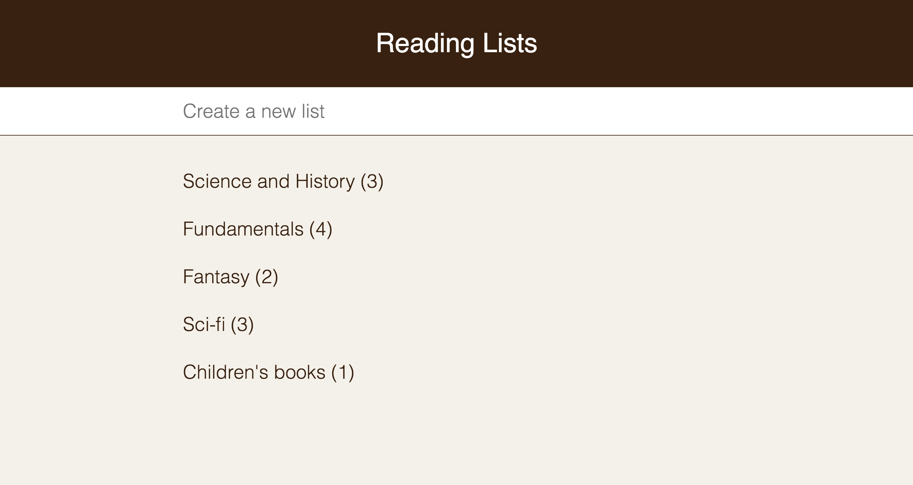

# [Reading Lists](https://build-mzqtetjwen.now.sh/)

## Features
- Create and edit reading lists
- Add books from Google Books
- Search with autosuggest
- Firebase storage

## Todo
- Add React drag and drop for React
- Dynamic URIs
- Improve search autosuggest
- Mock firebase calls with Jest

